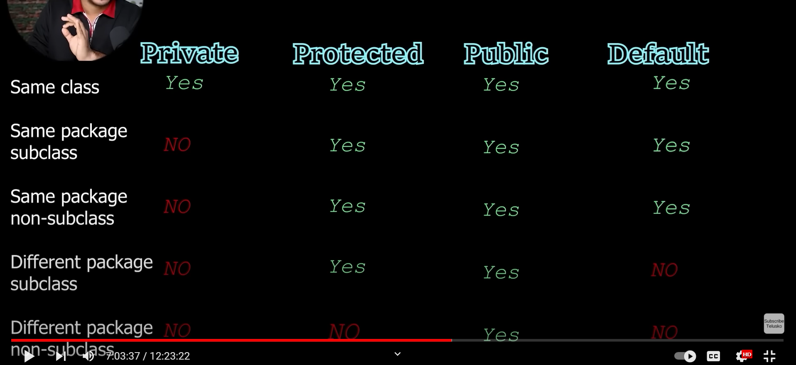

# 📝 Java Notes of [Youtube Course](https://www.youtube.com/watch?v=BGTx91t8q50&list=WL&index=1&t=20974s&ab_channel=Telusko).

## **Data Types**

```
 All data types: ***I Float, Clearly Don't Byte Short Long, Double. String!***


int:
Use for whole numbers without decimal points.
Example: int age = 25;


float:
Use for floating-point numbers with moderate precision.
Example: float temperature = 98.6f;

char:
Use for a single character.
Example: char grade = 'A';

boolean:
Use for variables that can have only two values: true or false.
Example: boolean isRaining = true;

byte:
Use when memory conservation is critical or when working with raw binary data.
Example: byte data = 120;

short:
Use when you need a larger range than byte but still want to conserve memory.
Example: short distance = 3000;

long:
Use for very large whole numbers.
Example: long population = 7000000000L;

double:
Use for floating-point numbers when higher precision is required.
Example: double pi = 3.14159265359;

String:
Use for storing sequences of characters or text.
Example: String greeting = "Hello, World!";


```

## Object and Classes

- This is how you create objects and classes and call the method in the other class

```
class Calculator {
   public int add() {
       int num1 = 6;
       int num2 = 56;
       int result = num1 + num2;
       System.out.println(" U_U L-6 in ObjectFile.java => " + result);
       return (result);

   }

}

public class ObjectFile {
   public static void main(String[] args) {

       Calculator calc = new Calculator();
       calc.add();

   }
}


```

## Create Array

```
int[] myNum = {10, 20, 30, 40};

OR

int myNum[] = {10, 20, 30, 40};


```

## Array loop

```

        for (int i = 0; i < 3; i++) {
            for (int j = 0; j < 4; j++) {
                System.out.println(nums[i][j] + " ");
            }

        }

        for (int n[] : nums) {
            for (int m : n) {
                System.out.println(m + " ");
            }

        }

```

## Static Variables

- To make something as class variables not object variables.

```
class Mobile {
    String brand;
    String price;
    static String name;

    static {
        name = "Mobile Apple IOS";
    } // It will call static variable only once

    public void show() {
        System.out.println(" U_U L-7 in StaticVariable.java => " + brand + " : " + price + " : " + name);

    }

    public static void show1(Mobile obj) {
        // Also here we can not call directly non static variable inside static method
        // But we can do indirectly by passing the object while calling this method
        System.out.println(obj.brand + " : " + obj.price + " : " + name);
    }

}

public class StaticVariable {
    public static void main(String[] args)

    {

        // Class.forName('Mobile'); // To call static method if you don't want to call
        // object
        Mobile obj1 = new Mobile();
        obj1.brand = "Xiaomi";
        obj1.price = "11,000";
        obj1.name = "Xiaomo S2";

        Mobile obj2 = new Mobile();
        obj2.brand = "Xiaomi";
        obj2.price = "11,000";
        // obj2.name = "Xiaomo S3"; // Avoid, call static with class name
        Mobile.name = "Xiaomo S3";

        obj1.show();
        obj2.show();

        // Mobile.show(); Not allowed to call non static method directly from class
        Mobile.show1(obj1);

    }
}


```

## Encapsulation

```

class Human {
    private int age = 11;
    private String name = "Vansh"; // It is available only in the same class

    public int getAge() {
        return (age);
    }

    public String getName() {
        return (name);
    }

    public void setAge(int value) {
        age = value;
    }
}

public class Encapsulation {
    public static void main(String[] args) {
        Human obj = new Human();

        obj.setAge(30);
        // obj.name = "Vansh Sharma";

        System.out.println(obj.getName() + " : " + obj.getAge());
    }

}

```

## Constructors

- It should be same as a class name
- Does not return anything
- It get called automatically whenever object is created

```
class Human {
    private int age;
    private String name;

    public Human() { // Default constructor

        age = 12;
        name = "Vansh";
    }

    public Human(int a, String userName) { // Parameterized constructor

        System.out.println(" U_U L-3 in Constructors.java => " + "Calling Constructor");
        age = a;
        name = userName;
    }

    public int getAge() {
        return age;
    }
}

public class Constructors {
    public static void main(String[] args) {
        Human obj1 = new Human();
        Human obj2 = new Human();

        System.out.println(" U_U L-22 in Constructors.java => " + obj1.getAge());

    }
}


```

## this and super

- If we add parameters to the object then it will call the parameterized constructor along with the default constructor of the parent class.
- Every constructor has the super() method even if we don't call it this super() method calls the constructor of the parent class based on if we pass the parameter or not.
- Every class in Java extends the Object class as in our case with class A
- this() will call all the constructor of the same class

```
class A {
    public A() {

        System.out.println(" U_U L-2 in ThisandSuper.java => " + "in A");
    }

    public A(int a) {
        System.out.println(" U_U L-12 in ThisandSuper.java => " + "in a int");
    }
}

class B extends A {

    public B() { // Constructor

        System.out.println(" U_U L-8 in ThisandSuper.java => " + "in B");
    }

    public B(int b) {
        this(); // will call all the constructor of the same classs
        // super(5) this will call the parameterized constructor of parnt class
        System.out.println(" U_U L-12 in ThisandSuper.java => " + "in b int");
    }
}

public class ThisandSuper {
    public static void main(String[] args) {
        B obj = new B(54); // this will call the parameterized constructor of the B

    }
}


```

## Naming conventions

```
constants = DATA, MY_DATA, PIE
class = Calc, Area
variable and methods = age, getArea()
Constructors = Area()
```

## Anonymous Object

- If we create the object without any reference then that is called the anonymous object.
- We can't use it again

```

class B  {

    public B() { // Constructor

        System.out.println(" U_U L-8 in ThisandSuper.java => " + "in B");
    }

   public void show(){
        System.out.println(" U_U L-8 in ThisandSuper.java => " + "Inside show");

   }
}

public class ThisandSuper {
    public static void main(String[] args) {

        new B().show(); // anonymous Object created

    }
}

```

## Inheritance

- When only 2 class is involved in the inheritance it is called single level inheritance
- More than 2 level is called multi level inheritance
- Multiple inheritance is not supported in the java because of the ambiguity to choose the method when method is present in multiple classes.
- If parent and child both has the same method then the child method will be given preferred because of the inheritance. _(Method overwriting)_
- _Method overloading_ in Java allows a class to have multiple methods with the same name but different parameter (number of parameters OR type of parameter)

```
class NormalCalc {
    public int add(int a, int b) {
        System.out.println(" U_U L-25 in Inheritance.java => " + "add method is getting called from parent here");
        return a + b;
    }

    public int sub(int a, int b) {

        return (a - b);

    }
}

class AdvCalc extends NormalCalc {

    public int multi(int a, int b) {
        return a * b;
    }

    public int div(int a, int b) {
        return a / b;
    }

    public int add(int a, int b) {
        System.out.println(" U_U L-25 in Inheritance.java => " + "add method is getting called from child here"); // this is called method overwriting
        return a + b;

    }

}

public class Inheritance {

    public static void main(String[] args) {
        AdvCalc nc = new AdvCalc();
        int r1 = nc.add(5, 3);
        int r2 = nc.sub(10, 3);
        int r3 = nc.multi(6, 3);
        int r4 = nc.div(8, 3);

        System.out.println(r1 + " " + r2 + " " + r3 + " " + r4);
    }

}


```

## Packages and Access modifiers

- **Packages**
  - Folders are called packages
  - '\*' means all the files in packages not the folders
  - package name should be unique
- **Modifiers**
  - Try to keep the class public
  - Try to keep the method public
  - Try to keep the variable private
  - Avoid using the default



## Polymorphism

- This obj is bheaving differently it is called polymorphism
- Which class obj will call will be decided at the run time.
- All this concept is called Dynamic method dispatch
- You can create your own method of the objects that will overwrite the inbuilt methods of the object.

```
class APoly {
    public void show() {
        System.out.println("In A Show Method");
    }
}

class BPoly extends APoly {
    public void show() {
        System.out.println("In B Show Method");
    }
}

public class Polymorphism {

    public static void main(String[] args) {
        APoly obj = new APoly();
        obj.show();
        obj = new BPoly();
        obj.show();


    }

}

```

## Final Keyword

- Use final keyword along with class, method and variable

```
   final double PIE = 3.14d;
   // PIE = 3.148456464d; // Can;t overwrite it because of the final in the variable

    public final void announcement() {
        System.out.println("Don't over write me!");
    }
```

## Upcasting and Downcasting

- When the variable is change to different type is called type casting
- When child object is casted as the parent object it is called upcasting
- Vice Versa of the above is called downcasting

```
double  d = 4.5;
int i  = (int) d;


APoly obj1 = new BPoly();
// APoly obj1 = (A) new BPoly(); // It is the same as above , it is calleupcasting
    obj1.show();

 // Casting to the correct type
BPoly obj2 = (BPoly) obj1; // It is called Downcasting
     obj2.show();

```

## Abstract Keyword

- If we don't know the functionality of the method then we can just declare it and does not define that method but we have to make this method and the class as abstract class
- You can't create the object of the abstract class
- Abstract class does not need to have the abstract method but vice versa is not true

```
abstract class Car {
    public abstract void drive();

    public abstract void flying();

    public void playMusic() {
        System.out.println("Playing Music");
    }
}

abstract class WagnoR extends Car {

    public void drive() { // If you extends the abstract class it is compulsory to define the abstract
                          // method
        System.out.println("I am Driving");

    }
}

class AdvanceWagonR extends WagnoR { // These classes are called conceret class

    public void flying() {
        System.out.println("This car is flying...");
    }
}

public class AbstractKeyword {
    // Car car = new Car(); We can't instantiate the abstract class

    public static void main(String[] args) {

        Car car = new AdvanceWagonR();
        car.drive();
        car.playMusic();
        car.flying();
    }
}
```

## Inner Class

- Defining class inside the class

```
class InnerA {

    int age = 5;

    public void show() {
        System.out.println("In InnerA Show");
    }

    static class InnerB {
        public void config() {
            System.out.println("InnerB Config");
        }
    }
}

public class InnerClass {
    public static void main(String[] args) {

        InnerA obj = new InnerA();
        obj.show();

        // InnerA.InnerB obj1 = obj.new InnerB();
        InnerA.InnerB obj1 = new InnerA.InnerB(); // If class InnerB is static

        obj1.config();

    }
}
```

## Anonymous Inner Class

- To do the method overwriting we need to create the another class and then method is updated in the extended class of the parent class but just to update the one method creating
  whole class is not necessary. For this we use _Anonymous Inner Class_

```
class A_AnonymousInnerClass {
   public void show() {
       System.out.println("Inside the A_AnonymousInnerClass");

   }
}

public class AnonymousInnerClass {
   public static void main(String[] args) {
       A_AnonymousInnerClass obj = new A_AnonymousInnerClass() {  // Since this class has no name this practice is called Anonymous Inner Class
           public void show() {
               System.out.println("Inside the A_AnonymousInnerClass without extending");

           }

       };
       obj.show();
   }
}
```
